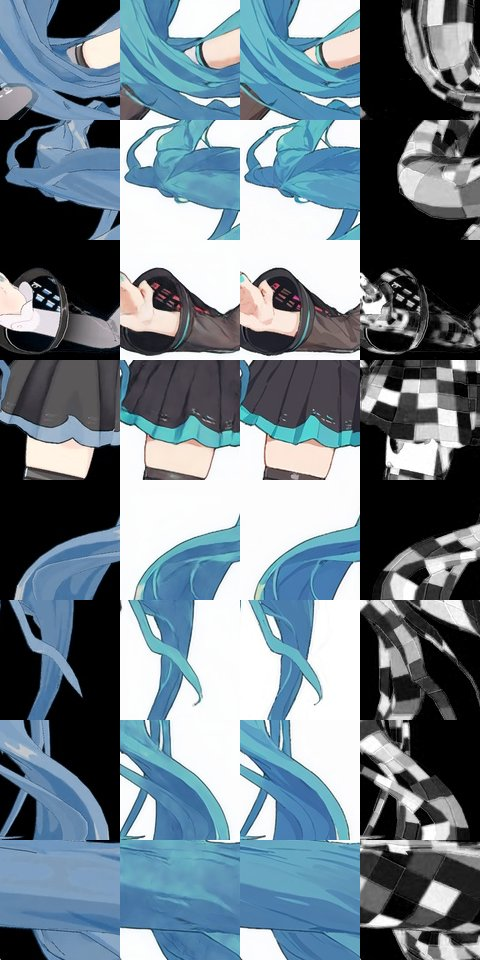

# Video-to-Video Few-Shot Patch-Based Training

<div align="center">
  


</div>

## 📋 Overview

A GAN-based image style transfer framework that performs style transformation using traditional CNN approaches without relying on Diffusion models. This repository was created to achieve Video-to-Video transformation as an alternative to Text-to-Video approaches using Diffusion models.

The main objective is to perform stable style transfer through GAN-based V2V approach while considering frame-to-frame character movement consistency.

## ⚠️ Project Status: Abandoned

This project has been discontinued. After extensive experimentation, we concluded that image generation using only traditional CNN approaches has significant limitations:

- The range of learning styles is too narrow
- Limited ability to generalize to new styles
- Lack of variation in generated results
- The output quality did not progress beyond basic colorization of the original data

These limitations led us to determine that the approach was not viable for our intended goals. We are leaving this repository available for educational purposes and as a reference for those interested in CNN-based style transfer techniques.

## ✨ Sample Results

<div align="center">

### Video Transformation Example


### Patch-Based Training Sample Image


</div>

## 🚀 Features

- 🎨 Style transfer using GAN architecture
- 📷 Sample size minimization through patch-based approach
- 🔲 Fast learning through convolution
- 🎞️ Improved learning accuracy with optional channel additions
- 🖼️ Frame-to-frame consistency for video transformation

## 🛠️ Installation

```bash
# Clone the repository
git clone https://github.com/yourusername/patch-toon.git
cd patch-toon

# Install dependencies
pip install -r requirements.txt
```

## 📊 Usage

### Training

```bash
python run_training.py
```

### Generation

```bash
python generator.py
```

### Configuration Options

You can customize the training and generation process by modifying the configuration files in the `config` folder.

## 📁 Project Structure

```
├── src                # Program folder
│   ├── models         # Neural network model definitions
│   ├── utils          # Utility functions
│   └── data           # Data processing modules
├── config             # Configuration settings
├── output             # Training results
├── test_dataset       # Sample dataset
├── examples_movie     # Example results and samples
├── generator.py       # Inference processing
└── run_training.py    # Training execution
```

## ⚙️ Model Configuration

Please refer to the `config` folder for detailed settings. Key configuration options include:

- Patch size and stride
- Learning rate and optimizer settings
- Network architecture parameters
- Training iterations and batch size

## 🔍 Limitations Compared to Diffusion Models

While our approach initially aimed to provide advantages in certain areas, we ultimately found several limitations:

- **Limited style range**: CNN approaches struggle to generalize beyond the specific styles they were trained on
- **Lack of creative variation**: Generated outputs show minimal variation compared to diffusion models
- **Quality ceiling**: The quality of results plateaued at a level comparable to basic colorization
- **Architectural constraints**: Traditional CNN architectures proved insufficient for complex style transformations

These limitations were the primary factors in our decision to discontinue the project in favor of more advanced approaches.

## 🔮 Future Directions

While this specific project has been abandoned, the following areas remain promising for future research:

- Integration of diffusion models with frame consistency techniques
- Hybrid approaches combining CNN efficiency with diffusion model quality
- Exploration of Vision Transformer (ViT) architectures for style transfer
- Development of more efficient training methods for video-to-video transformation

## 📄 License

This project is licensed under the AGPL-3.0 license - see the LICENSE file for details.

## 📚 References

[1] O. Texler et al., [Interactive Video Stylization Using Few-Shot Patch-Based Training](https://arxiv.org/abs/2004.14489), 2004

[2] [OndrejTexler/Few-Shot-Patch-Based-Training](https://github.com/OndrejTexler/Few-Shot-Patch-Based-Training)